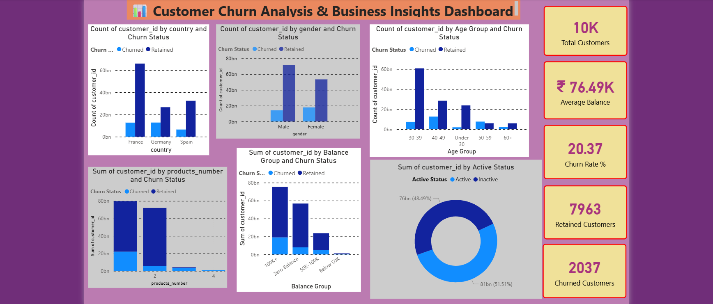

# 📊 Customer Churn Analysis Dashboard

---

## 🔍 Project Overview

This project focuses on analyzing customer churn behavior in a banking dataset using Power BI.

The goal is to identify:

* Why customers leave
* Which customers are at risk
* Key factors affecting retention

---

## 🛠 Tools & Technologies

* Power BI
* Excel
* DAX (Data Analysis Expressions)

---

## 📊 Dashboard Features

* Total Customers, Churned Customers, Retention Rate
* Churn analysis by:

  * Country
  * Gender
  * Age Group
  * Account Balance
  * Active Membership
* Interactive slicers for filtering

---

## 📈 Key Business Insights

* Inactive customers are more likely to churn
* Customers with zero balance show higher churn rates
* Certain age groups (30–50) have higher churn probability
* Geography impacts churn behavior significantly
* Customers with fewer products tend to churn more

---

## 📁 Files Included

* Customer_Churn_Dashboard.pbix
* dashboard.png (Dashboard Screenshot)

---

## 🚀 How to Use

1. Download the `.pbix` file
2. Open in Power BI Desktop
3. Explore dashboard using filters and visuals

---

## ❓ Business Questions Answered
- Which customers are most likely to churn?
- Does active membership affect churn?
- Which country has highest churn?
- How does balance impact churn?
- Do customers with fewer products churn more?

---
## 💡 Conclusion

This dashboard helps businesses:

* Identify high-risk customers
* Improve retention strategies
* Make data-driven decisions

---

## 👩‍💻 Author

**Medha Desawale**
